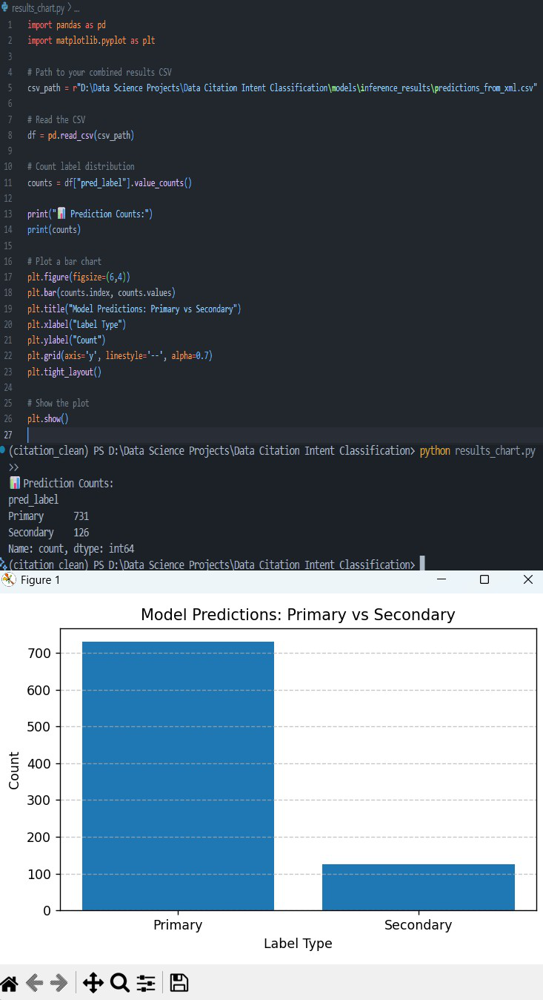

# 🧠 Data Citation Intent Classification

### 📘 About the Project
This project classifies **sentences in research papers** as either:
- 🟢 **Primary** — when a dataset is *used* in the research  
- 🔵 **Secondary** — when a dataset is *only mentioned or compared*  

The model reads research papers (in XML format), extracts relevant text, and uses a **fine-tuned BERT model** to automatically identify how datasets are referenced.

💡 **In simple terms:**  
Instead of manually reading hundreds of research papers, this project helps identify which ones actually *use* datasets for experiments (true research content) and which ones just *mention* or *compare* them.  

For example:  
If you have **100 research papers**, the model can automatically tell you that only **20 contain real dataset usage**, and the remaining **80** are just background mentions — saving researchers hours of manual effort.

---

### 💡 Real-World Use Case
In real life, this system helps:
- 🏛 **Research organizations** (Elsevier, Springer, arXiv, etc.) automatically detect dataset usage.  
- 🧾 **Dataset creators** track where their datasets are *actually reused*.  
- 🧠 **Researchers** analyze dataset influence and reuse patterns.

This enables large-scale **scientific data analytics** for understanding dataset impact and research trends.

---

### 📁 Folder Structure
```
D:\Data Science Projects\Data Citation Intent Classification\
│
├── data/
│   ├── raw/
│   │   ├── train/
│   │   ├── test/
│   │   └── sample_submission.csv
│   └── processed/
│       ├── train_labeled.csv
│       ├── train_preprocessed.csv
│
├── models/
│   ├── bert_baseline_model/
│   └── inference_results/
│
├── notebooks/
│   ├── 01_parse_xml.ipynb
│   ├── 02_preprocess.ipynb
│   ├── 03_baseline_model.ipynb
│   └── 04_bert_finetuning.ipynb
|
|
├── Screenshots/
              │
              ├── 01_project_structure.png
              ├── 02_xml_parsing.png
              ├── 03_preprocessing.png
              ├── 04_training.png
              ├── 05_text_inference.png
              ├── 06_xml_inference.png
              ├── 07_results_chart.png
              └── 08_readme_preview.png
│
├── .gitignore
├── citation_clean.yaml
├── inference_from_xml.py
├── inference_text.py
├── README.md
├── Requirements.txt
└── results_chart.py

```

---

### ⚙️ Installation & Setup

1️⃣ Clone the repository:
```bash
git clone https://github.com/<your-username>/Data-Citation-Intent-Classification.git
cd Data-Citation-Intent-Classification
```

2️⃣ Create and activate your environment:
```bash
conda create -n citation_clean python=3.10
conda activate citation_clean
```

3️⃣ Install dependencies:
```bash
pip install -r Requirements.txt
```

---

### 🚀 How to Run

#### 🧩 1. Single Sentence Inference
For testing one example sentence:
```bash
python inference_text.py
```
Example:
```
🧠 Input: We trained our model using the ImageNet dataset.
✅ Prediction: Primary
```

#### 📄 2. Full XML Paper Inference
Place your test XML files inside:
```
data/raw/test/XML/
```
Then run:
```bash
python inference_from_xml.py
```

Each XML file’s predictions will be saved under:
```
models/inference_results/
```

All combined results are saved as:
```
models/inference_results/predictions_from_xml.csv
```

---

### 📊 3. Visualize Results
Run the following to plot a bar chart of predictions:
```bash
python results_chart.py
```

It will show the total number of **Primary vs Secondary** sentences classified.

📸 *Example Output:*  


---

### 🧾 Label Descriptions
| Label | Meaning | Example |
|--------|----------|----------|
| 🟢 **Primary (0)** | Dataset used in the paper (collected or trained upon) | “We trained our model using the ImageNet dataset.” |
| 🔵 **Secondary (1)** | Dataset only mentioned or compared | “We compared our results with ImageNet.” |

---

### 📈 Results Summary
After running on **25 XML research papers**:
- Total sentences classified: **857**
- 🟢 **Primary:** 731 (~85%)
- 🔵 **Secondary:** 126 (~15%)

✅ Model successfully extracted and classified dataset-related sentences across all test files.

---

### 🧠 Technologies Used
- Python 🐍  
- Hugging Face Transformers (BERT)  
- PyTorch  
- Pandas, NumPy, Scikit-learn  
- BeautifulSoup, lxml (XML Parsing)  
- Matplotlib (Visualization)

---

### 🧰 Requirements
All dependencies are listed in [`Requirements.txt`](./Requirements.txt).
Install them with:
```bash
pip install -r Requirements.txt
```

---

### 📂 Dataset
Dataset Source:  
🔗 [Kaggle — Make Data Count: Finding Data References](https://www.kaggle.com/competitions/make-data-count-finding-data-references)

This dataset includes research papers in XML format where sentences around dataset mentions are labeled as **Primary** (dataset used) or **Secondary** (mentioned).

⚠️ *Due to size and license limits, dataset files are not included. Please download manually and organize as shown in the structure above.*

---

### 🚀 Future Scope
- Large-scale dataset usage analytics.  
- Help dataset creators track citation and reuse impact.  
- Assist research portals in dataset influence tracking.  
- Provide funding agencies insight into open-data impact.

---

### 🧑‍💻 Author
👤 **Sohum Patil**  
💼 Aspiring Data Scientist | AI Research Enthusiast  

If you found this project useful, please ⭐ the repo on GitHub!

📬 **Contact:**  
📧 *sohum7even@gmail.com*

---

✨ *“Turning research data into insights — one sentence at a time.”* 💖
